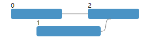

# tdagla - Layout for TDAG

Tdagla is a JavaScript library to lay out temporal directed acyclic graphs (TDAG).

# Usage
### Step 1: Create an instance
```js
const tdag = tdagla.create()
```

### Step 2: Set nodes and edges
```js
tdag.setNode({id: 0, x0: 0, x1: 100})
    .setNode({id: 1, x0: 50, x1: 175})
    .setNode({id: 2, x0: 150, x1: 250})

tdag.setEdge({src: 0, dst: 2})
    .setEdge({src: 1, dst: 2})
```

### Step 3: Lay out
```js
tdag.setGap(20)         // the minimum distance between adjacent nodes on the same line (default: 20)
tdag.setLineHeight(10)  // i.e., the height of node (default: 10)
tdag.setLineSpace(5)    // the distance between two lines (default: 5)

tdag.layout()           // lay out TDAG
```

### Step 4: Get result
```js
const node = tdag.getNode(0)
const nodes = tdag.getNodes()

const edge = tdag.getEdge(0, 2)
const edges = tdag.getEdges()
```
You can use D3 or any other approaches to visualize the result:



This example file is provided in the folder `examples`.

# Browser Scripts

We provide a browser-ready script `tdagla.min.js`. You can find it in the `dist` folder.

# Source Build
Before building this library, you need to install `Node.js`. Then, run following commands from the root of the project:
```bash
npm install
npm run build
```

Then the result file will be generated in the `dist` folder.
